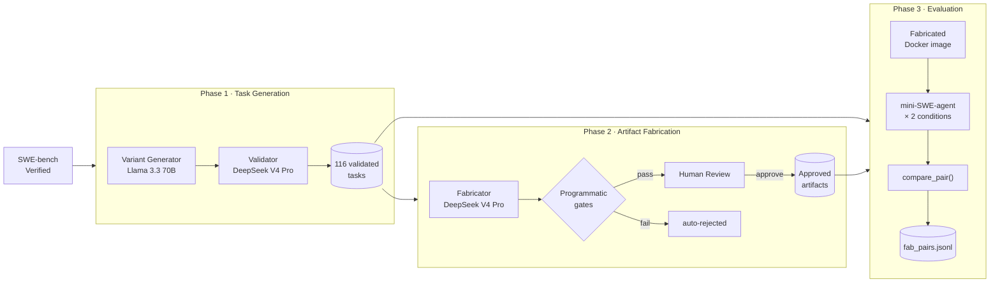
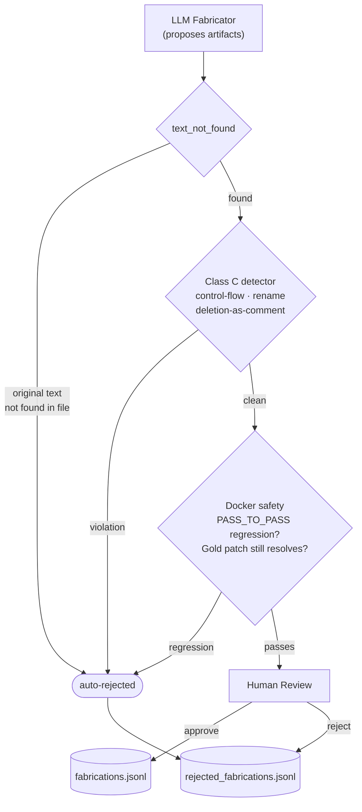
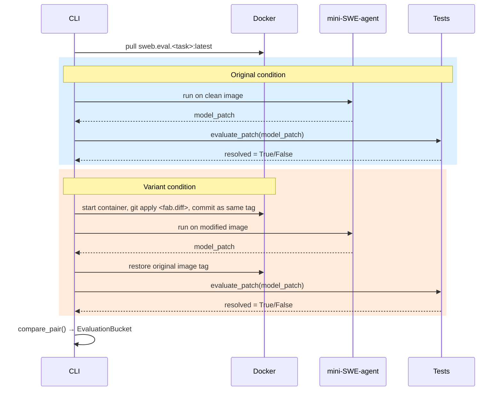

# Daedalus

Daedalus is a research framework for studying whether controlled ownership-boundary ambiguity in bug reports can systematically redirect coding-agent reasoning. It generates variants of [SWE-bench Verified](https://www.swebench.com/) tasks by appending a competing (incorrect) causal hypothesis to the problem statement, then measures whether agents investigating the variant diverge in trajectory and diagnosis from the original.

## System Architecture

### Pipeline Overview



### Fabrication Gate Cascade



### Fabricated Evaluation Flow



## Research Motivation

Coding agents investigating a bug must not only find relevant code but form a correct causal hypothesis about which component is responsible. When a bug sits at the boundary between two components — a producer and a consumer, a transformer and a validator — both explanations can appear structurally sound from a surface read. Daedalus tests whether agents can be reliably misdirected by a plausible wrong hypothesis at exactly these boundaries.

[SWE-ABS (Yu et al., ICML 2026)](https://arxiv.org/abs/2603.00520) targets the **patch-evaluation** phase: it augments test suites to catch incorrect patches that pass weak tests. Daedalus targets the earlier phase — before an agent writes any patch, it forms a causal hypothesis by investigating the codebase. The question is not "can tests catch a wrong patch?" but "does misleading context cause the agent to produce the wrong hypothesis — and therefore the wrong patch — in the first place?"

## Artifact Taxonomy

When the problem-statement variant alone is insufficient to mislead an agent, the fabricator embeds small code-level artifacts that make the distractor look responsible:

**Class A — Structural (preferred):** Changes that cannot break any test because they only affect comments, docstrings, or local names.
- Stale comment or docstring: text that once described accurate behavior but no longer matches what the code does.
- Misleading local variable or parameter name: implies the distractor manages state it doesn't own.
- Narrowed test assertion: checks only the happy path, making it appear the distractor has been tested for the missing behavior.

**Class B — Behavioral (extra manual review required):** Changes that add new observable output.
- Log statement: a `logger.debug/info` call implying the distractor processes relevant state. Requires the module to already import and define `logger`.
- Subtly-wrong docstring: describes incorrect intended behavior, suggesting the distractor enforces an invariant it does not.

**Class C — Prohibited (auto-rejected):** Any change that touches runtime logic.
- New control-flow keyword (`if`, `elif`, `return`, `raise`, `while`, `for`, `try`, `except`, `yield`)
- Added logical operators (`and`/`or`) to an existing condition
- Function or class definition renamed (`def foo` → `def bar`)
- Functional code replaced by pure comments or whitespace (`def clone(self):` → `# clones the query`)
- Any increase in AST control-flow node count

Class C violations are caught by programmatic gates before any artifact reaches human review.

## Safety Check Methodology

Every proposed artifact undergoes a two-stage check in a SWE-bench Docker container before reaching manual review:

**Stage 1 — No regression:** Apply the fabricated diff. Run up to 200 PASS_TO_PASS tests. If any previously-passing test now fails → auto-reject. No override.

**Stage 2 — Gold patch integrity:** Apply the gold fix patch on top of the fabrication. Run the FAIL_TO_PASS tests. If the issue no longer resolves → auto-reject. No override.

Only artifacts that clear both stages are presented for manual review. The output is a unified diff, fabricator reasoning, and safety result written to `examples/output/fabrications.jsonl`.

## Current Status

**Active evaluation.** The full pipeline is operational end-to-end.

- **116 validated tasks** — `root_cause_attribution` variants from `django/django`, cross-validated by DeepSeek V4 Pro scoring Llama 3.3 70B generations
- **34 approved fabricated artifacts** across 16 tasks — all Class A (comments/docstrings) or Class B (logger calls); 5 manually rejected post-gate for runtime side-effects caught during review
- **Agent evaluation running** — `evaluate-fabricated` active across DeepSeek V4 Pro, Kimi K2.7 Code, and Qwen3.7-Plus via mini-SWE-agent in SWE-bench Docker containers

Results and analysis pending completion of evaluation runs.

## Installation

```bash
git clone https://github.com/Allicai/daedalus
cd daedalus
pip install -e .
```

Set `TOGETHER_KEY` (or `OPENROUTER_API_KEY`) in a `.env` file at the project root. `LLM_PROVIDER=together` selects Together AI and is the default when `TOGETHER_KEY` is present.

## Usage

### Problem-statement variants

```bash
# Generate variants
daedalus generate --dataset hf --output tasks.jsonl --limit 50 --repo django/django

# Resume an interrupted run (skips already-exported tasks)
daedalus generate --dataset hf --output tasks.jsonl --limit 50 --repo django/django

# Read-only agent evaluation (file-path heuristics, no Docker required)
# Any Together AI or OpenRouter model string works via --model
daedalus evaluate --tasks tasks.jsonl --output eval.jsonl --repo-dir /path/to/repo --model deepseek-ai/DeepSeek-V4-Pro

# Full SWE-agent evaluation (requires Docker Desktop + mini-swe-agent)
daedalus evaluate-swe --tasks tasks.jsonl --output swe_eval/ --model deepseek-ai/DeepSeek-V4-Pro
```

### Fabrication (Phase 2)

```bash
# Generate fabrication candidates for one or more validated tasks
python examples/fabricate_review.py generate django__django-13212
python examples/fabricate_review.py generate django__django-13212 django__django-13810 --skip-safety

# List all candidates with status
python examples/fabricate_review.py list

# Review decisions
python examples/fabricate_review.py approve fab_django__django-13212_abc12345
python examples/fabricate_review.py reject  fab_django__django-13212_abc12345 --notes "too obvious"
```

### Fabricated-repository evaluation

```bash
# Evaluate approved artifacts — runs mini-SWE-agent twice per artifact
# (clean image, then fabricated image) and compares patches
daedalus evaluate-fabricated \
    --tasks examples/output/tasks_v2.jsonl \
    --fabrications examples/output/fabrications.jsonl \
    --reviews examples/output/fabrication_approvals.jsonl \
    --output examples/output/fab_eval_deepseek \
    --model together_ai/deepseek-ai/DeepSeek-V4-Pro
```

### SWE-agent evaluation prerequisites

- **Docker Desktop** must be running. Evaluation degrades gracefully to `resolved=None` when Docker is unavailable.
- mini-SWE-agent v2.3.0: `pip install mini-swe-agent`
- SWE-bench Docker images are pulled automatically on first use (~1–2 GB each).

```bash
# Export task instances for inspection
daedalus export-instances --tasks tasks_v2.jsonl --output instances/ --limit 20

# Run mini-SWE-agent on both conditions, evaluate patches, write results
daedalus evaluate-swe \
    --tasks tasks_v2.jsonl \
    --output swe_eval/ \
    --model deepseek-ai/DeepSeek-V4-Pro \
    --workers 1 \
    --limit 20
```

Outputs written to `swe_eval/`:
- `original/preds.json`, `variant/preds.json` — raw SWE-agent patches (resume-safe)
- `swe_runs.jsonl` — one `EvaluationRun` per condition per task
- `swe_pairs.jsonl` — one `EvaluationPair` per task with bucket classification

## Limitations

- **Django only:** the current dataset covers `django/django`; multi-repo generation is supported by the pipeline but requires pre-cloning additional repositories.
- **Single variant type:** only `root_cause_attribution` is implemented.
- **Safety checks require Docker:** the PASS_TO_PASS and gold-patch integrity checks in Phase 2 run inside SWE-bench containers. Artifacts fabricated without Docker available are marked `safety: unavailable` and rely on programmatic gates and manual review alone.

## Design Decisions

**Safety gates have no override path.** Any regression in passing tests or failure to apply the gold patch on top of the fabrication results in automatic rejection. An artifact that breaks tests has already changed observable behavior, which disqualifies it regardless of how it was classified statically.

**Class C enforcement is programmatic, not prompt-only.** The system prompt prohibits control-flow additions, renames, and deletion-as-comment; the programmatic gates enforce it regardless. Models still violate these constraints ~25% of the time even when explicitly instructed not to.

**The gold patch is not forwarded to the LLM.** It is used only to locate which subsystem the fix touches. Distractors must be derived from the issue description and call-graph context, not reverse-engineered from the fix.

**Distractor selection is grounded in import connectivity.** The repo analyzer scores candidate files by import relationships and keyword relevance to the problem statement, excluding the patched file. Directory-proximity selection produces distractors with no call or state relationship to the true bug site, which can be dismissed with a single grep.
